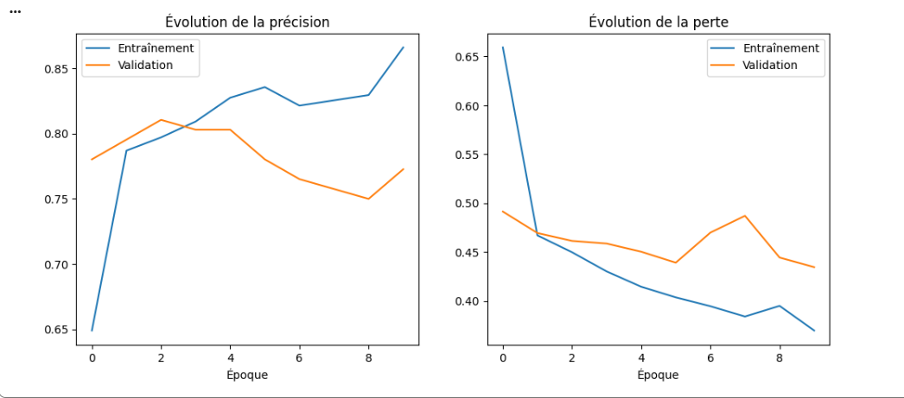
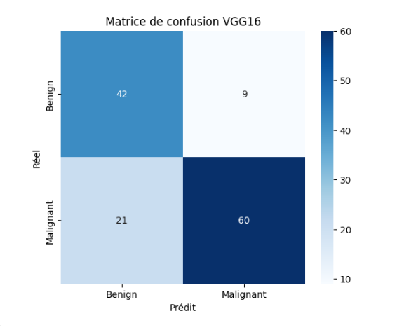
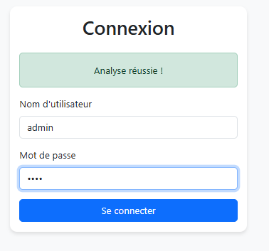
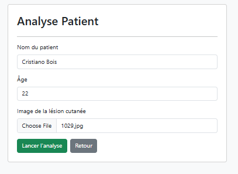
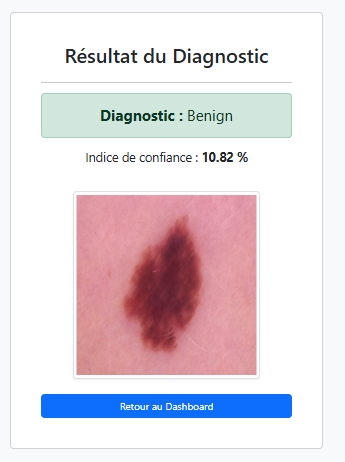

# Application Web de Détection du Cancer de la Peau - IA & Flask

Ce projet complet a été réalisé dans le cadre des TD 7 (Deep Learning / Transfer Learning) et TD 8 (Développement Web / Bases de données). Il présente une solution d'aide au diagnostic médical capable de classifier des images de lésions cutanées en deux catégories : **Bénigne** ou **Maligne**.

---

## 🔬 Partie 1 : Entraînement de l'IA (Transfer Learning VGG16)

Le modèle de Deep Learning a été conçu et entraîné sur Google Colab en utilisant le principe du **Transfer Learning** à partir de l'architecture pré-entraînée **VGG16**.

### 1. Préparation des données & Augmentation
Le jeu de données comprenait **493 images d'entraînement** et **132 images de test**, réparties en 2 classes. Pour limiter le surapprentissage, une augmentation de données a été appliquée via `ImageDataGenerator` (rotations, zooms, translations et normalisation `/255.0`).

### 2. Architecture du Modèle personnalisé
- **Base** : VGG16 (poids `imagenet`) dont toutes les couches ont été **gelées** (`trainable=False`).
- **Nouvelle Tête de Classification** :
  - `Flatten` : Pour aplatir les cartes de caractéristiques.
  - `Dense(256, activation='relu')` : Couche intermédiaire.
  - `Dropout(0.5)` : Pour la régularisation.
  - `Dense(1, activation='sigmoid')` : Pour obtenir une sortie binaire (0 ou 1).

### 3. Performances & Évaluation (TD 7)
Le modèle a été entraîné sur **10 époques** avec l'optimiseur Adam ($learning\_rate = 10^{-4}$) et la fonction de perte `binary_crossentropy`.

#### Courbes d'apprentissage
  

#### Matrice de Confusion & Diagnostic
La matrice de confusion permet de valider la sensibilité médicale du modèle en mesurant les Vrais Positifs, Vrais Négatifs, Faux Positifs et Faux Négatifs.
  

Le modèle final a été exporté sous le format standard `vgg16_skin_cancer.h5` pour être intégré au serveur web.

---

## 💻 Partie 2 : L'Application Web Flask (TD 8)

L'application web permet aux praticiens d'utiliser le modèle IA à travers une interface graphique conviviale et de sauvegarder l'historique des consultations.

### Architecture du Système (Pipeline Complet)
[Utilisateur/Médecin] ──(Image + Infos)──> [ Serveur Flask ] ──(Prédiction)──> [ Modèle VGG16 (.h5) ]
▲                                        │
│                                 (Enregistrement)
└───────────(Affichage)──────────────────▼
[ Base MySQL (XAMPP) ]


### 💻 Parcours de l'application en images

#### 1. Authentification Unique (Sécurité)
Pour accéder à l'application et sécuriser l'accès aux données médicales, l'utilisateur doit obligatoirement s'authentifier. Les identifiants saisis sont vérifiés de manière dynamique par le serveur Flask via une requête SQL ciblant la table `users` de la base de données.



#### 2. Formulaire d'Analyse du Patient
Une fois connecté, le médecin est redirigé vers le tableau de bord (Dashboard). Depuis cet espace, il peut soumettre une nouvelle analyse clinique en renseignant le nom et l'âge du patient, puis en téléchargeant la photographie de la lésion cutanée suspecte.



#### 3. Résultat du Diagnostic et Indice de Confiance
Dès la validation du formulaire, l'image subit un prétraitement automatique (redimensionnement en $224 \times 224 \times 3$ pixels et normalisation) avant d'être soumise au modèle de Deep Learning VGG16. 

Le système applique un seuil de décision strict : un score supérieur à `0.5` classe la lésion comme maligne (**Malignant**), tandis qu'un score inférieur ou égal la classe comme bénigne (**Benign**). L'interface affiche instantanément le verdict accompagné de son indice de confiance précis.



#### 4. Persistance des données (MySQL)
Afin d'assurer un suivi médical rigoureux, chaque diagnostic généré par l'intelligence artificielle est instantanément journalisé en base de données. Le système enregistre le nom, l'âge, le verdict exact, la probabilité brute calculée et le chemin d'accès local de l'image au sein de la table `patients`. L'historique complet reste ainsi accessible à tout moment via l'onglet dédié.

---

## 📦 Installation et Lancement Local

### 📋 Prérequis système
1. Démarrez les modules **Apache** et **MySQL** depuis le panneau de contrôle **XAMPP**.
2. Accédez à votre interface `phpMyAdmin`, créez la base de données `skin_cancer_db` et importez-y le fichier de structure `database.sql`.
3. Assurez-vous que le fichier du modèle entraîné **`vgg16_skin_cancer.h5`** est correctement positionné dans le répertoire `model/`.

### 🚀 Exécution de l'application
Ouvrez un terminal de commandes positionné à la racine du projet et exécutez la commande suivante :
```bash
python app.py
Une fois le serveur démarré, ouvrez votre navigateur web et accédez à l'adresse suivante : http://127.0.0.1:5000